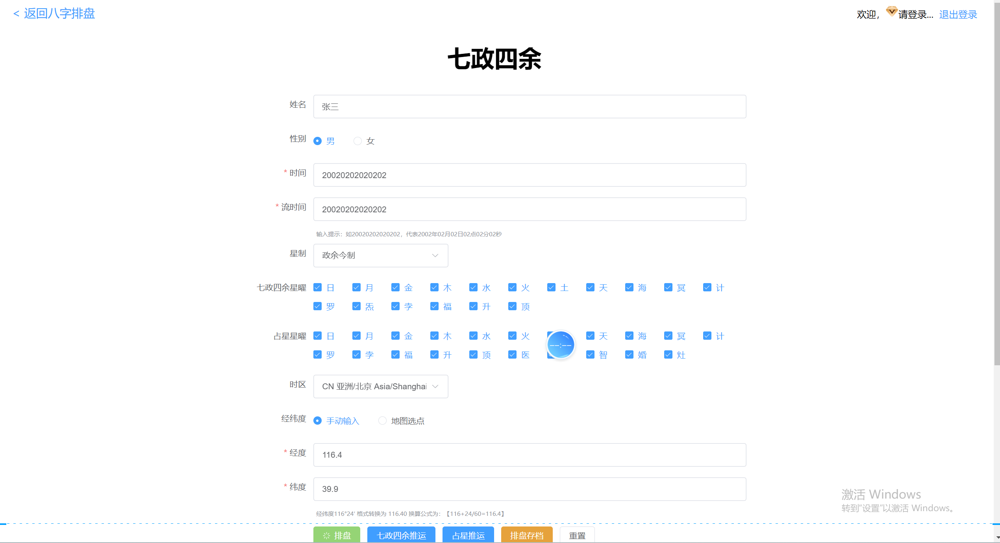
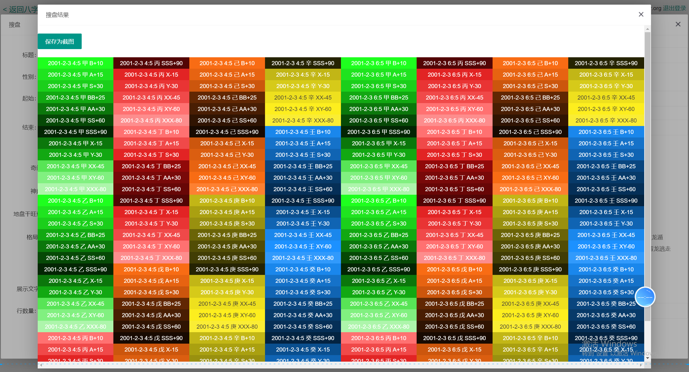
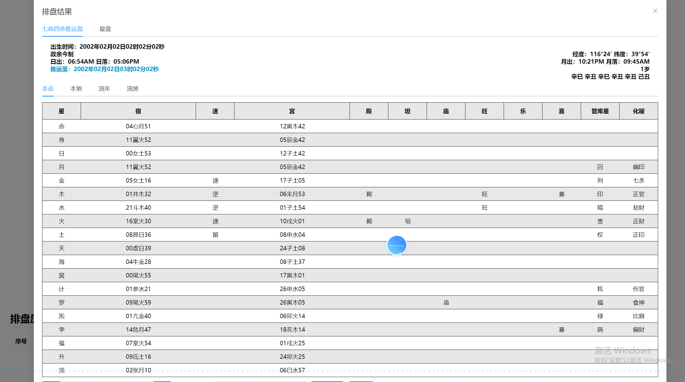

# 🔮 Zhouyi Divination System | 周易算命系统 | 周易占卜系統|周易命理分析系统
**I Ching (Yijing) • Bazi • Ziwei • Qimen Dunjia**  
**周易 • 八字 • 紫微斗数 • 奇门遁甲分析引擎**
🔥 Chinese Fortune Telling Platform | 命理系统 | 命理系統  
👉 Bazi + Bagua + Five Elements | API Ready | SaaS Ready | Commercial Use  

---

## 🧠 项目定位 / 專案定位 / Project Overview

本项目是一套完整的周易命理计算系统，基于中国传统易学理论开发  
本專案是一套完整的周易命理計算系統，基於中國傳統易學理論開發  
This is a complete Zhouyi-based metaphysics calculation system based on traditional Chinese I-Ching theory  

包含核心命理算法：  
包含核心命理算法：  
Including core calculation modules:

- 八字（四柱） / 八字（四柱） / Bazi (Four Pillars)  
- 八卦 / 八卦 / Bagua  
- 五行 / 五行 / Five Elements  
- 易经推演 / 易經推演 / I-Ching divination  

👉 可用于商业化命理平台或API系统  
👉 可用於商業化命理平台或API系統  
👉 Ready for commercial deployment  

## 🎯 Core Systems | 核心系统

### 🧧 1. I Ching (Yijing) Engine | 周易引擎
- Generates Hexagram (卦象)
- Provides line-by-line interpretation (爻辞)
- Uses the ancient wisdom for divination and advice

---

### 🌌 2. Bazi Engine | 八字系统
- Generates Four Pillars of Destiny (年/月/日/时)
- Ten Gods analysis (十神)  
- Five Elements balancing (五行强弱)  
- Luck cycle calculations (大运/流年)

---

### 🧭 3. Ziwei Doushu Engine | 紫微斗数系统
- 12 Palaces chart generation (十二宫排盘)
- Star distribution and analysis (主星/辅星)
- Career, marriage, and health palace analysis

---

### 🧑‍⚖️ 4. Qimen Dunjia Engine | 奇门遁甲系统
- Time-space grid generation (九宫排盘)
- Heavenly stems & earthly branches (天干地支)
- Door, Star, and God configuration analysis

## ⚙️ 技术价值 / 技術價值 / Features

- 基于时间的命理推算引擎 / 基於時間的推算引擎 / Time-based calculation engine  
- 传统易经算法实现 / 傳統易經算法 / Traditional I-Ching algorithms  
- 多模型融合预测 / 多模型融合預測 / Multi-method prediction system  
- 支持API扩展 / 支援API擴展 / API-ready architecture  
- 模块化设计 / 模組化設計 / Modular system  

---

## 🏆 使用场景 / 使用場景 / Use Cases

- 命理网站 / 命理網站 / Fortune telling website  
- 算命APP / 算命App / Astrology mobile app  
- AI预测系统 / AI預測系統 / AI prediction system  
- 个人命运分析工具 / 個人命運分析工具 / Personal destiny tools  
- SaaS平台 / SaaS平台 / SaaS platform  
## 🌐 Use Cases | 应用场景
Personal divination and life guidance
Research and academic studies in metaphysics
Integration into AI-powered cultural applications
Teaching and learning tool for traditional Chinese metaphysics
API service for divination predictions
## 📊 Performance | 性能表现
Chart Generation: < 100ms
Multi-system analysis: < 300ms
Fully stateless and scalable architecture
API-ready design for easy integration
---
## 🏗 System Architecture | 系统架构

graph TD
    A[User Input (Birth Data)] --> B[Data Normalization Layer]
    B --> C[System Core Logic (I Ching, Bazi, Ziwei, Qimen)]
    C --> D1[I Ching Engine]
    C --> D2[Bazi Engine]
    C --> D3[Ziwei Engine]
    C --> D4[Qimen Engine]

    D1 --> E[Interpretation Layer]
    D2 --> E
    D3 --> E
    D4 --> E

    E --> F[UI Output / API Output]

## 📊 示例输出 / 示例輸出 / Example Result

输入 / 輸入 / Input:  
1990-01-01 12:00  

输出 / 輸出 / Output:  
- 八字排盘 / 八字排盤 / Bazi chart  
- 五行分析 / 五行分析 / Five Elements analysis  
- 命运解读 / 命運解讀 / Destiny interpretation  

---

## 🔗 API示例 / API範例 / API Example

---
GET /api/calculate?birth=1990-01-01
{
  "bazi": "example",
  "analysis": "your destiny analysis result"
}
---
## 🔗 快速运行 / 快速啟動 / Quick Start
git clone https://github.com/your-repo/zhouyi  
cd zhouyi  

git clone xxx  
npm install  
npm run start
## 📸 排盘界面真实截图 / Screenshots

  
**无极八字排盘界面 | Wuji Bazi Chart**

  
**八字排盘界面 | Four Pillars Bazi**

  
**五行分析界面 | Five Elements Analysis**

  
**流年运势分析 | Annual Luck Analysis**

  
**大六壬排盘界面 | Da Liuren Chart**

  
**七政四余排盘界面 | Qizheng Siyü Chart**

  
**七政四余详细排盘 | Qizheng Detailed Chart**

  
**综合排盘总览界面 | Overall Divination Chart**
## 📊📊 项目截图 / 專案截圖 / Screenshots

👉 Add real screenshots here (very important)
---
## 🎥 演示视频 / 演示影片 / Demo
 联系TG：@xuzongbin001

## 📩 联系方式 / 聯絡方式 / Contact

📱 Telegram：@xuzongbin001

📧 Email：masterai918@gmail.com

🔑 Keywords
##⭐ Why This Project | 项目价值
✔ Comprehensive: Combines multiple divination systems into one cohesive platform
✔ Fast and Efficient: Optimized for fast calculation and result generation
✔ Scalable and Modular: Easily extensible with new systems and features
✔ API-Ready: Ready for integration into other applications and services
✔ Open Source: Contribute and help improve the platform
Zhouyi, I-Ching, Bazi, Bagua, Five Elements, Fortune Telling, Divination, Chinese Metaphysics, Prediction System

