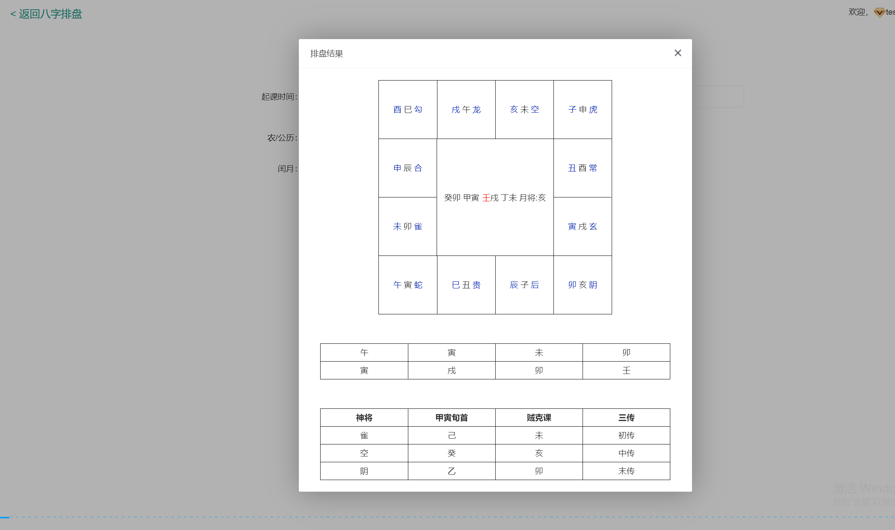

[简体中文](README.md) | [繁體中文](README.zh-TW.md) | [English](README.en.md)

  

# 周易原始碼：八字排盤、紫微斗數、奇門遁甲與七政四餘

> 瀏覽器端傳統文化軟體技術快照，可核驗四柱八字、十神、藏干、刑沖合害、大運、時區及天文輔助 JavaScript，並提供七政四餘、大六壬及綜合排盤真實截圖。

<table><tr><td width="50%" align="center"> <strong>無極八字排盤</strong></td><td width="50%" align="center"> <strong>七政四餘排盤</strong></td></tr></table>

## 產品功能

| 系統 | 內容 |
|---|---|
| 四柱八字 | 干支、十神、藏干、刑沖合害及大運資料 |
| 五行與流年 | 產品結果頁與八字計算資料 |
| 七政四餘與大六壬 | 真實介面截圖；完整服務端算法需另行核驗 |
| 紫微與奇門整合 | 產品與整合參考，不等同完整本地引擎 |

## 排盤流程

1. 輸入日期、時間、時區及排盤參數。
2. 時間歸一化並形成四柱資料。
3. 處理十神、藏干、關係及大運資料。
4. 呈現排盤結果或請求整合服務。

## 可驗證程式碼

- <code>paipan.js</code>: 八字、十神、藏干、大運及天文片段
- <code>paipan.gx.js</code>: 干支刑沖合害關係
- <code>timezone.js</code>, <code>astro.js</code>: 時區與天文輔助
- <code>utils.js</code>: 請求、日期格式及圖片保存

## 產品截圖

<table><tr><td width="50%" align="center"> <strong>四柱八字</strong></td><td width="50%" align="center"> <strong>五行分析</strong></td></tr><tr><td width="50%" align="center"> <strong>大六壬</strong></td><td width="50%" align="center"> <strong>七政四餘詳細盤</strong></td></tr></table>

## Documentation

- [周易與易經原始碼](https://masterai-top.github.io/Zhouyi-Divination-System-Source-Code/zh-tw/zhouyi-yijing-source-code.html)
- [八字與四柱](https://masterai-top.github.io/Zhouyi-Divination-System-Source-Code/zh-tw/bazi-four-pillars.html)
- [紫微與奇門](https://masterai-top.github.io/Zhouyi-Divination-System-Source-Code/zh-tw/ziwei-qimen.html)
- [七政四餘](https://masterai-top.github.io/Zhouyi-Divination-System-Source-Code/zh-tw/qizheng-siyu.html)

## 範圍與免責

倉庫可驗證所列瀏覽器程式碼與截圖；部分頁面呼叫服務端介面，不能把所有截圖功能描述為完整離線引擎。內容僅供傳統文化軟體研究，不構成確定性、醫療、法律、金融或人生建議。
